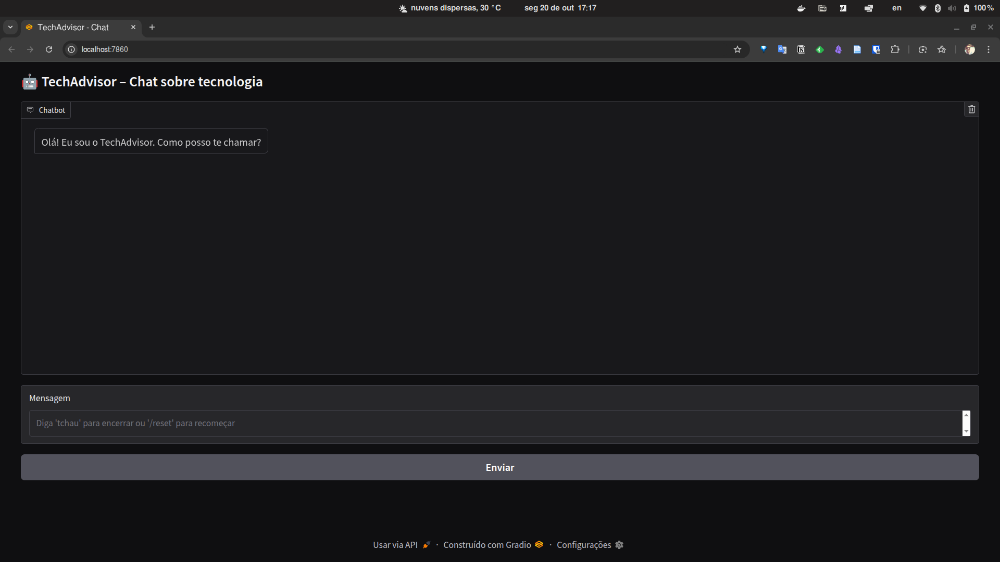
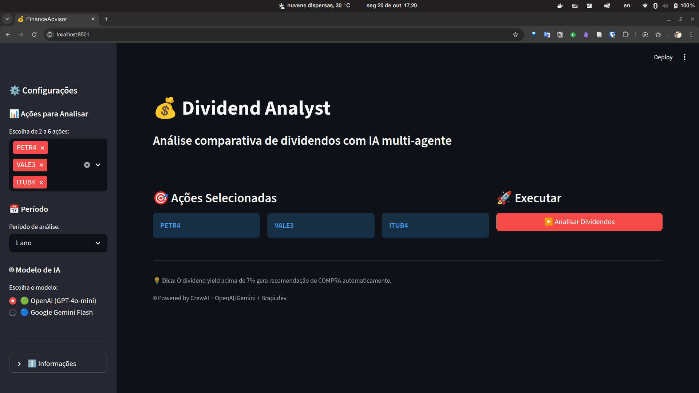

# AKCITCamp 2025

O **AKCITCamp 2025** é um ambiente modular para experimentação e execução de agentes inteligentes especializados. Os agentes podem ser executados de forma independente, comunicando-se com serviços externos ou com outras instâncias por meio de APIs, Redis ou aplicações locais (como Streamlit, Gradio). 

## Estrutura do Projeto

A estrutura principal do projeto consiste em:

```
akcitcamp-2025/
├── agents
│   ├── financeadvisor
│   └── techadvisor
├── docker-compose.yml
├── Dockerfile
├── LICENSE
├── README.md
└── requirements.txt
```


## Instalação via Docker

### 1. Clonar o repositório

```bash
git clone https://github.com/alexandrebarb0sa/akcitcamp-2025;
cd akcitcamp-2025
```

### 2. Build da imagem

```bash
docker compose build
```

### 3. Subir todos os containers com Docker Compose

```bash
docker compose up -d
```

Verifique a versão do `docker` instalado caso tenha problemas com os comandos:

```bash
docker --version
```

`Docker version 28.5.1, build e180ab8`


## APIs keys

É necessário obter as **APIs keys** para inserir nos arquivos `.env` de cada agente. As chaves são necessárias para realizar as chamadas para as LLMs:

- Google Gemini: https://aistudio.google.com/app/api-keys

- OpenAI: https://platform.openai.com/api-keys


## Jupyter Lab

Caso queira acessar o projeto no ambiente do Jupyter Lab, acesse o endereço http://localhost:8888/lab. Caso esteja demorando a iniciar, certifique-se de que o container esteja executando:

```
docker compose up jupyter -d
```


## Agentes

### 👨‍💻 TechAdvisor

O **TechAdvisor** é um agente voltado para consultoria técnica, desenvolvimento de software e suporte tecnológico. Possui interface gráfica local (`agente_gui.py`) e scripts de execução modular. 

```
techadvisor/
├── agente_gui.py
├── .env-template
├── README.md
├── requirements.txt
└── techadvisor_agent.py
```

Arquivos principais:

- `techadvisor_agent.py`: lógica principal do agente.
- `agente_gui.py`: interface local para interação.
  - http://localhost:7860

- `.env-template`: Renomeie para `.env` e insira uma **API Key** válida.

🐋 **DOCKER**

`docker compose up techadvisor -d`

`docker exec -it techadvisor bash`

O agente estará disponível no endereço http://localhost:7860. É preciso aguardar alguns instantes para o serviço subir por completo, o tempo pode variar de máquina para máquina (~ 30s).




### 🤑 FinanceAdvisor

O **FinanceAdvisor** é um agente financeiro que analisa dados, calcula métricas e exibe resultados por meio de uma interface **Streamlit**.

```
financeadvisor/
├── APP_VISUAL.md
├── financeadvisor
│   ├── core
│   ├── crew
│   ├── .env-template
│   ├── __init__.py
│   ├── main.py
│   ├── README.md
│   ├── requirements.txt
│   └── utils
├── run_app.sh
├── run_redis.sh
├── streamlit_app.py
└── STREAMLIT_README.md
```

Estruturas principais:

- `financeadvisor/core`: módulos de carregamento de dados e cálculo de métricas.
- `financeadvisor/crew`: ferramentas auxiliares e orquestração.
- `streamlit_app.py`: aplicação web para visualização.
  - http://localhost:8501

- `run_app.sh`: script de inicialização.
- `.env-template`: Renomeie para `.env` e insira uma **API Key** válida.

🐋 **DOCKER**

`docker compose up financeadvisor -d`

`docker exec -it financeadvisor bash`

O agente estará disponível no endereço http://localhost:8501. É preciso aguardar alguns instantes para o serviço subir por completo, o tempo pode variar de máquina para máquina (~ 30s).




## Licença

Este projeto é distribuído sob os termos da licença MIT. 
Sinta-se à vontade para utilizar, modificar e distribuir conforme as condições da licença.

---

© 2025 AKCITCamp. Todos os direitos reservados.

